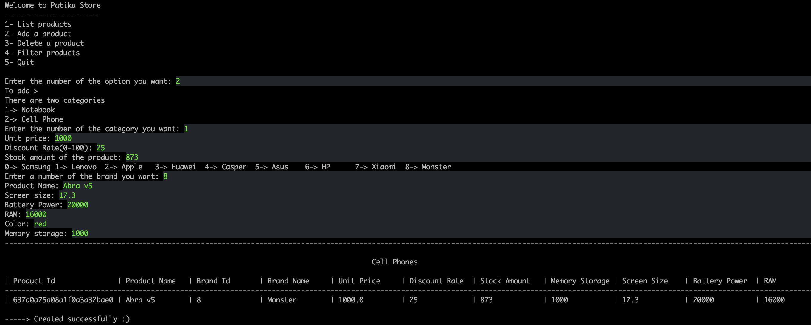

# Patika Store
## That is a product management system.
### An example


### Details:
You can:
- create a product(notebook or cell phone)
- list the products of a category you select
- delete a product by id
- filter products in a selected group
### Requirements:
* JDK (version 17 is recommended)
* Maven

### To run:
Open the project on your IDE and then your IDE can recognise Maven, and you can run Main class. Its directory is : 
```src/main/java/store/Main.java```

## Author

👤 **Furkan Denizhan**

- GitHub: [nevisende](https://github.com/nevisende)
- Twitter: [@nevisen_de](https://twitter.com/nevisen_de)
- LinkedIn: [furkan-denizhan](https://www.linkedin.com/in/furkan-denizhan/)

## 🤝 Contributing

Contributions, issues, and feature requests are welcome!

Feel free to check the [issues page](../../issues/).

## Show your support

Give a ⭐️ if you like this project!

## Acknowledgments

- This repo is created for  www.patika.dev and ebebek Java & QA & SAP Spartacus Practicum.
